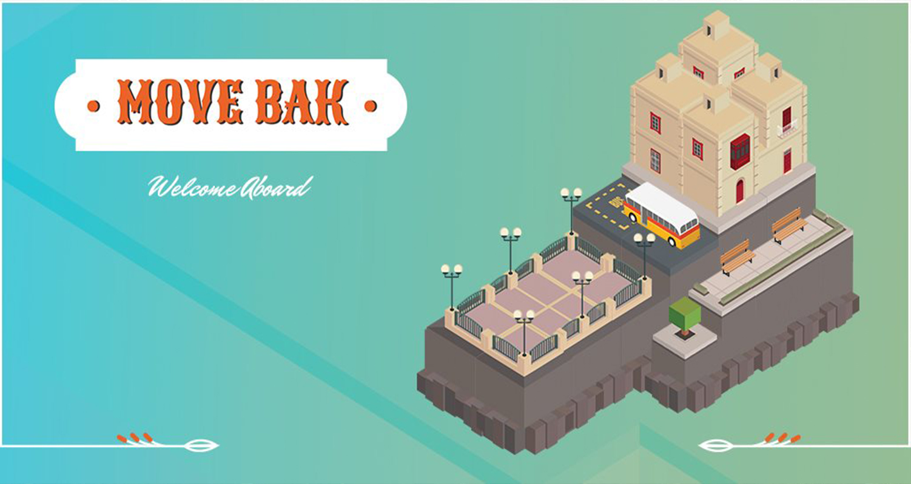
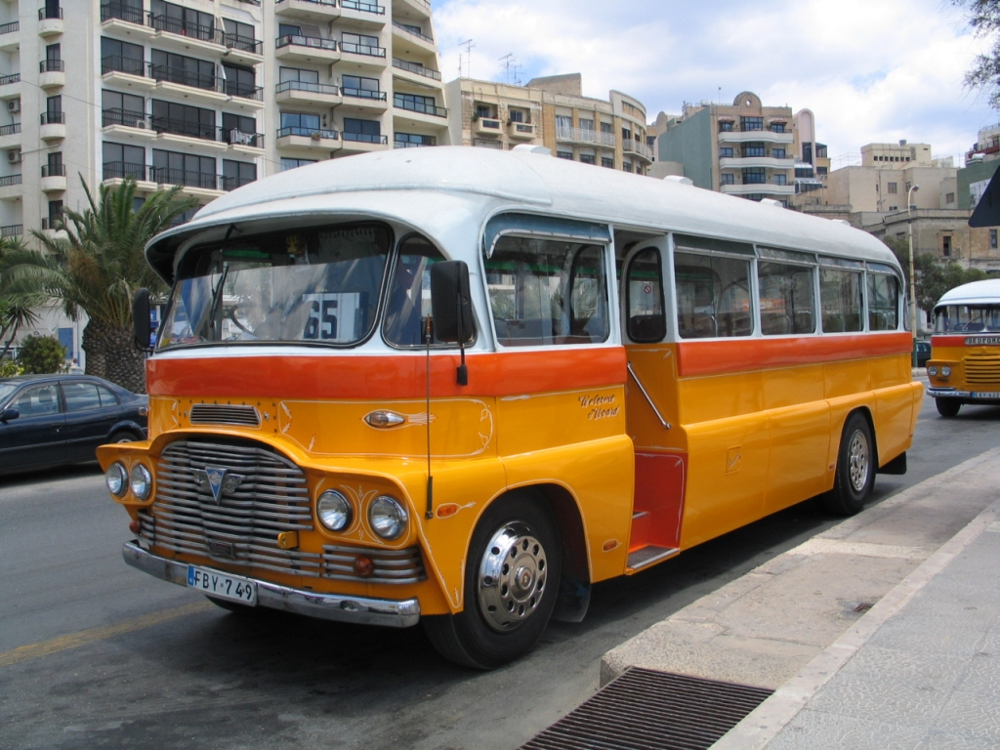
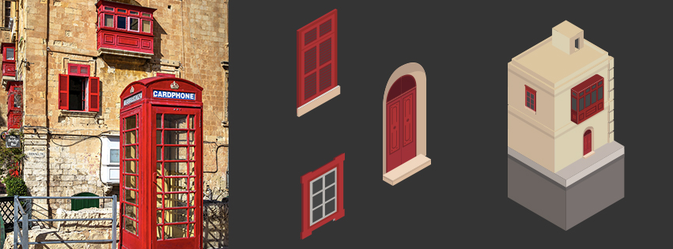

So here we are. After weeks of work and countless trial and errors I can see the light at the end of the development tunnel for my upcoming game.    

##What is Move Bak?

Move Bak is a mobile game for iOS and Android, developed in Unity, where the player takes control of a Maltese Bus and roams around the levels picking up tourists. The Game itself is an ode to a time where the iconic busses were a common sight.  The name of the game, as some of you who used the public service in Malta might have guessed, is a reference to the infamous command of the bus driver. “Move Back!!” is yelled whenever the passengers are crowding at the front of the vehicle, thus invading the personal space of the driver.

I might sound like I’m making fun of how things used to be, and in all honesty the public transport was far from perfect… but it had character and loads of it! I guess the idea to work on this project came in part from a sense of nostalgia my brother and I feel towards the rough, scruffy times where the Tal-Linja was indeed the King of the road.

##Why a Mobile Game?

This project was built (start to finish) by my brother and myself during our free time, thus we tried to limit the scope to mobile devices. Keeping the feature pool limited was a constant struggle as excitement is usually a bad ingredient for estimation. The other more important reason why we are releasing on Mobile is that we want people to play our game while using public transport. It just seems fitting.

##Art direction

For this project we wanted to move away from 2D because we wanted to try something different from previous projects, and 3D is too time consuming for 2 people. We finally settled on minimalistic isometric tiles to represent the Maltese landscape as we think this style borrows itself well to the small device and is quite fast to produce. In future updates I will consider including more elements that make the level more “Maltese”. Maybe some cranes…

##Game design 

The game was stripped out of everything that was not a ‘must have’ on purpose. From the get-go the aim was to release a small game, measure reception and if we like it enough, we take it to the next step. There is an endless backlog of features that we would like to develop and include, however the priority was always to release something that, in its rawest form, can still be enjoyable. 

Looking Bak, my younger self tried more ambitious projects and maybe age is giving me an understanding on my limitations and priorities. So, for this one we agreed to keep the scope very, very limited. 

##Moving forward

After the release of Move Bak, we plan to keep releasing content on a bi-weekly basis for some months. After that we will most probably split focus, and while I will look into polishing a bit Move Bak, my brother will start working on the engine of the next game. 

Working on Move Bak was a blast. Hopefully we can continue to optimize our development process to make this kind of articles more frequent. 

__P.S.__ It would mean the world to me if you can follow our facebook page and support the release of the game by downloading it and leaving a review when it finally hits Google Play  and the AppStore.

